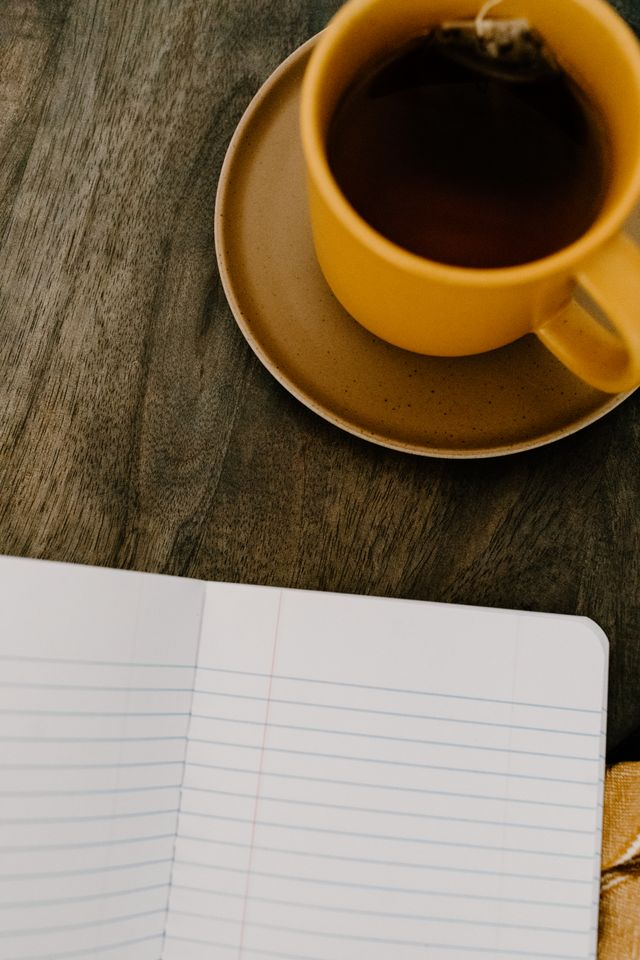

# The Favourite Thing I Wrote

Hello there! My name is Kaydin Smith-Cyr. The favourite thing I wrote is my current journal that has a cat with a cowboy hat on the cover and a lock. I have started the journal a few months ago and have been trying my best to keep up with entries. I do not show the journal to anyone and its just for me, and I am trying to make that my favourite thing about the experience.

 I am in therapy and am told that having a solid 'narrative' about trauma can help with healing. Its important to learn about what I like and learn more about myself outside of other people. I enjoy journaling, my cats, painting, drawing, and learning those are important.

  
